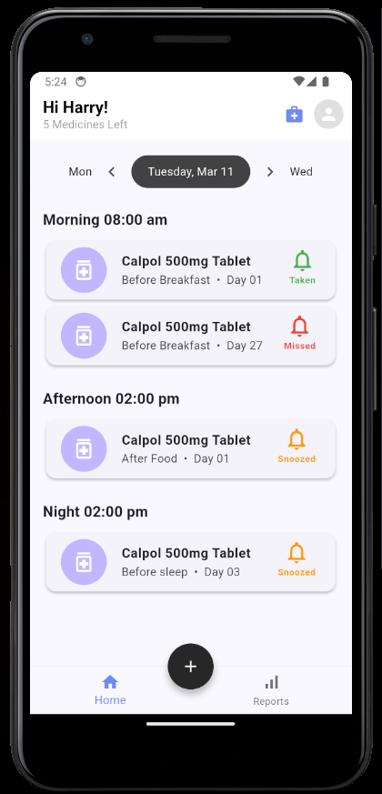
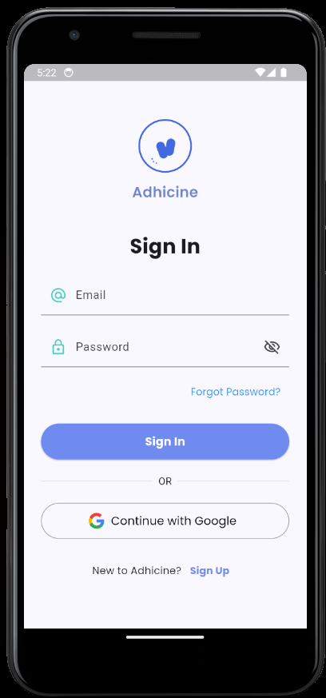
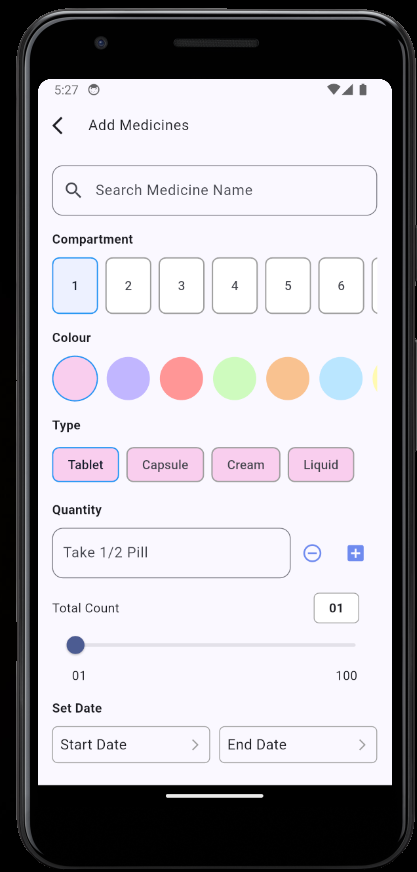
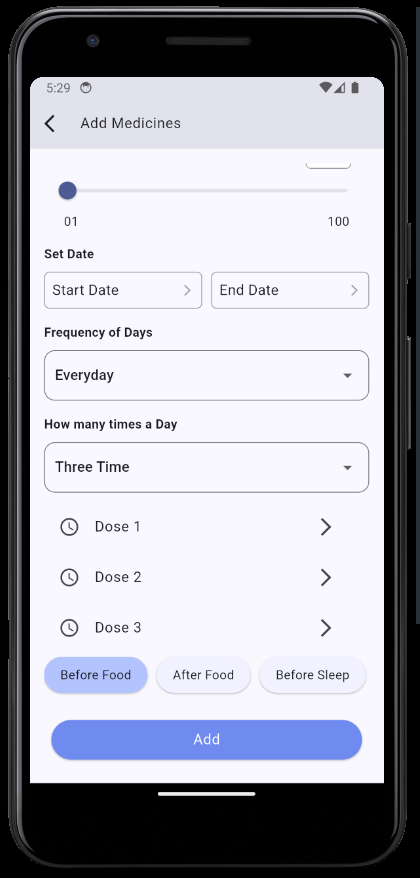
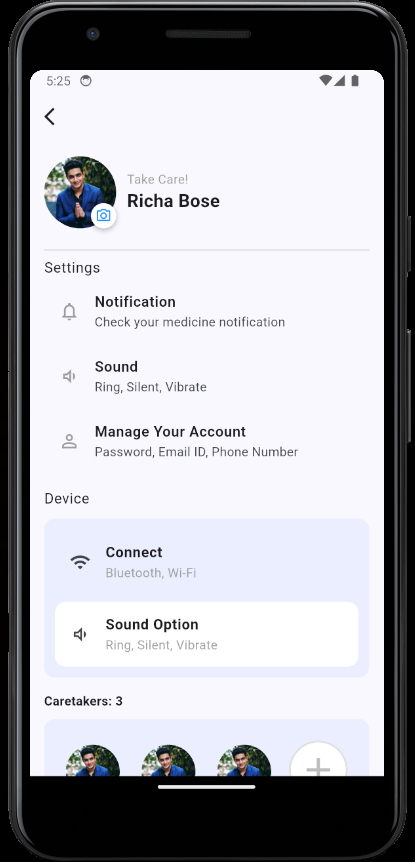
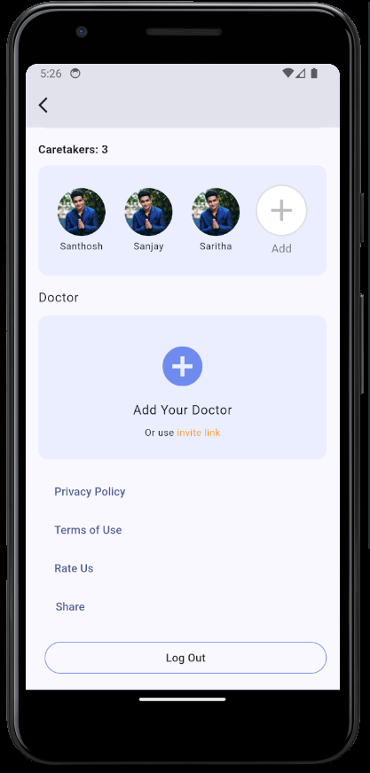
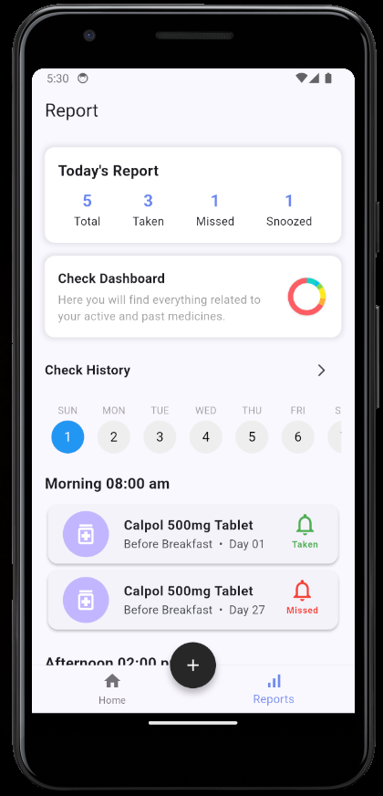

# adhicine

Adhicine is a Flutter-based mobile application designed to provide seamless and efficient user experiences. This project is developed using Flutter and Dart,

## Getting Started

# Adhicine

**Adhicine** is a Flutter-based mobile application designed to provide seamless and efficient user experiences. This project is developed using Flutter and Dart, ensuring cross-platform compatibility.


## Tech Stack

- **Framework:** Flutter
- **Language:** Dart


### Prerequisites
Ensure you have the following installed:

- Flutter : [Download](https://flutter.dev/docs/get-started/install)
- Dart
- Android Studio / VS Code 

### Installation

1. **Clone the Repository**
   ```sh
   git clone https://github.com/SanthoshKumar19M/Adhicine_flutter_task.git
   cd adhicine
   ```

2. **Install Dependencies**
   ```sh
   flutter pub get
   ```

3. **Run the Application**
   ```sh
   flutter run
   ```

## Screenshots

### Home Page


### Sign-in Page


### Add Medicine



### Profile Page



### Reports Page


## Project Structure

```
adhicine/
│── lib/
│   ├── main.dart       # Entry point of the app
│   ├── core            # Constants
│   ├── views/          # UI screens
│   ├── widgets/        # Reusable components
│── assets/             # Images
│── pubspec.yaml        # Package dependencies
│── README.md           # Project documentation
```

## 👨‍💻 Contributor

- **Santhosh Kumar S** (Developer)

## APK

- https://drive.google.com/file/d/191c03DOj39paiKgR7TxzilVMUv73LR3p/view?usp=sharing
